# The Impact of Memory Strategies on LLM-Based Sokoban Gameplay

**Aditri Patil** — apatil26@stanford.edu  
**Kerui Lu** — keruilu@stanford.edu

CS348K (Visual Computing Systems) · 2nd June 2026

---

## Main Takeaways

1. **Memory helps, but format trades off failure modes.** Same-level retry lifts eval solve rate from **33.3%** to **50–54%** at K=3. **Compact summary** and **raw trajectory** tie at **54.2%**; **heuristics** reach **50.0%** with stronger legality but less progress. Raw keeps richer spatial context and fewer deadlocks; compact gives a clearer verifier signal on unreachable standing cells.

2. **Instance-specific feedback beats global rules.** Same-level retry at 54.2% vs. train-to-eval global heuristics at **37.5%** (top-3 rules).

3. **Harness quality was the technical crux**—full-path JSON planning, local verifier (BFS + deadlock checks), token-budgeted memory renderers, and stratified levels—not raw API usage.
---

## Background and Setup

### What is Sokoban?

Sokoban is a grid puzzle in which the goal is to push every box onto a target square. The player moves one cell at a time and can only push boxes into open cells; boxes cannot be pushed through walls or into other boxes (two adjacent boxes also cannot be pushed together).

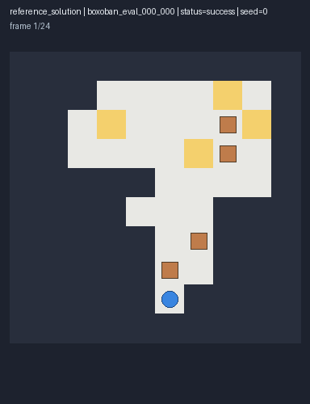

The figure above shows a representative Boxoban level: the blue circle is the player, brown squares are boxes, and yellow squares are targets. Any box can be placed on any target, but each push changes the board and can affect future reachability.

### Why is Sokoban hard for LLMs?

A single bad push can create an irreversible deadlock, so mistakes compound over a long horizon.

The three core challenges are:

1. **Irreversible moves lead to deadlocks** — Because you can only push boxes, many moves lead to irreversible states such as deadlocks. This figure shows several deadlock patterns found in the game:

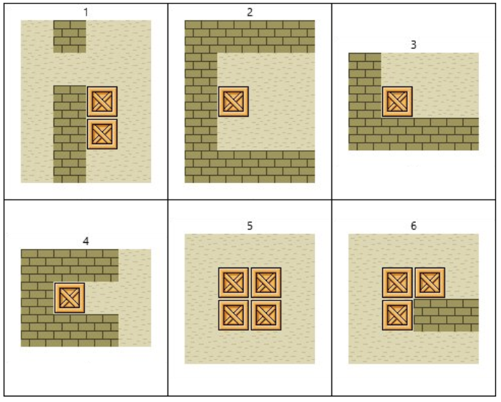

For example, in the figure above, a single push can trap a box against a wall or another box (Deadlock 3: non-target corner). Another can create a 2×2 box freeze (Deadlock 5). The verifier can detect these patterns before executing a push, but an earlier legal move can still leave the board in a state that later becomes a deadlock.

2. **Coordinate tracking of multiple boxes** — The LLM must track spatial details such as box coordinates, target locations, player position, and walls.

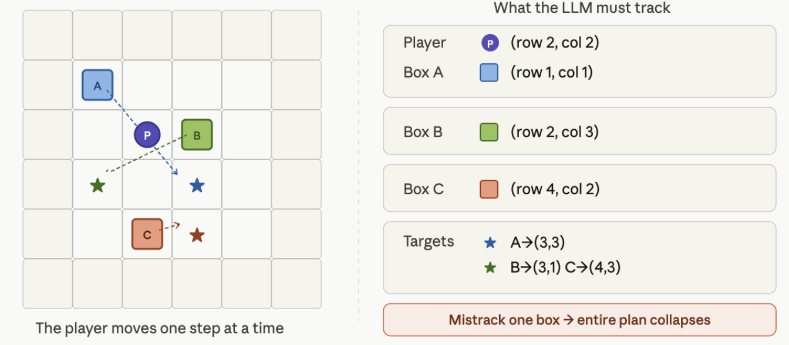

The model must keep these coordinates consistent across every push in the plan; a single wrong `[row, col]` invalidates the rest of the plan.

3. **Long-horizon planning** — The search space for Sokoban grows quickly with plan length: with \(n\) pushes, there are on the order of \(4^n\) possible action sequences. A move that looks good locally can therefore create a later deadlock. Sparse reward structure also makes long-term planning harder for LLMs.

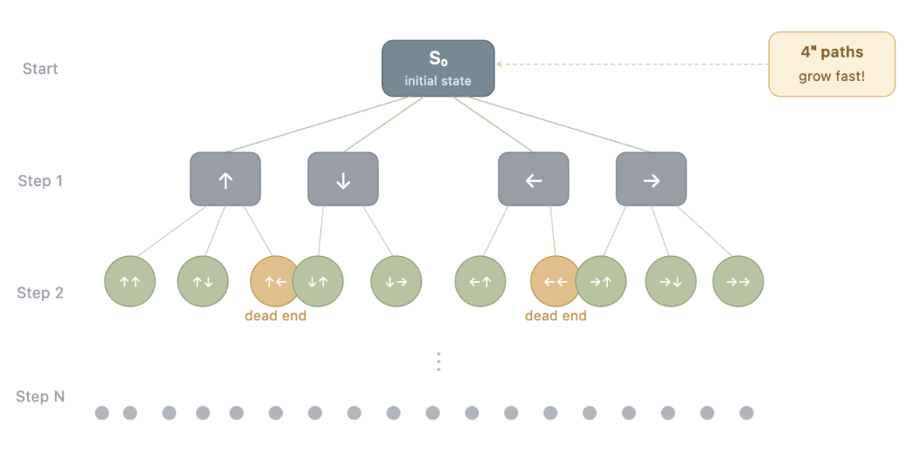

### Our Baselines

Before building memory, we first tested whether a plain LLM agent could solve Sokoban under different prompt formats. We ran a no-memory LLM agent on 12 training levels with temperature 0 and a verifier that checks each proposed push.

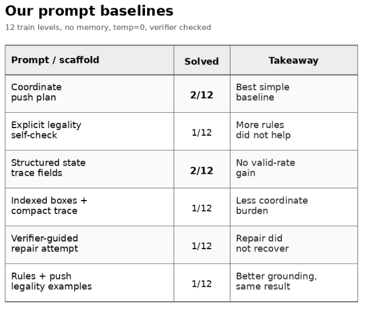

We tried several prompt variants to improve the low solve rate. Even our best early prompt solved only 2 of 12 training levels, and most failures were invalid plans—consistent with the weak Sokoban scores reported in prior benchmarks (see **Prior work** below).

### Prior work

Three papers shaped how we thought about memory for Sokoban:

- **LMGame Bench** (Zhang et al.) applies visual encoding and a memory module to Sokoban, but does not compare *which* memory representation works best. Table 1 (truncated) below shows that many top models score **0** without substantial harness support—the same regime as our baseline runs.

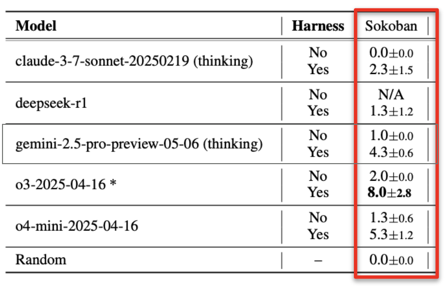

- **Reflexion** (Shinn et al.) reinforces language agents through *linguistic feedback* after failure on coding benchmarks—short rules rather than full environment traces.
- **Synapse** (Liang et al.) uses *retrieved full trajectories* as in-context exemplars for long-horizon computer-control tasks—concrete state–action context rather than abstract advice.

Together, these lines suggest that failure feedback can help, and that the *format* of that feedback may matter as much as whether memory exists at all.

**Why we focused on raw trajectory and heuristic memory.** LMGame shows memory can help on Sokoban but leaves the representation question open. Our early failures were dominated by **invalid plans** and verifier-detected traps (~48% of failures)—so we needed memory grounded in *what actually went wrong* on the board, under a fixed local verifier.

- **Raw trajectory memory** follows the Synapse intuition: keep spatial context from the failed attempt (boards, failed push, push log) so the planner can revise a concrete full-path plan on retry.
- **Reflection heuristics** follow Reflexion: distill failures into short, reusable rules—useful when trajectories are too long for the token budget or when we want cross-level transfer (train-to-eval global heuristics).

We also added **compact verifier summary** as a middle ground between the two: structured failure subtype and verifier reason without full trajectory bulk. Our ablations ask which signal best improves full-path planning on Boxoban under matched models, caches, and attempt budgets.

### Research questions

This background motivated the following research questions:

1. **Can memory of previous gameplay trajectories help improve LLM Sokoban performance?** 
2. **What kinds of memory help improve LLM Sokoban performance?** 

To answer these questions, we defined one baseline and three memory conditions.

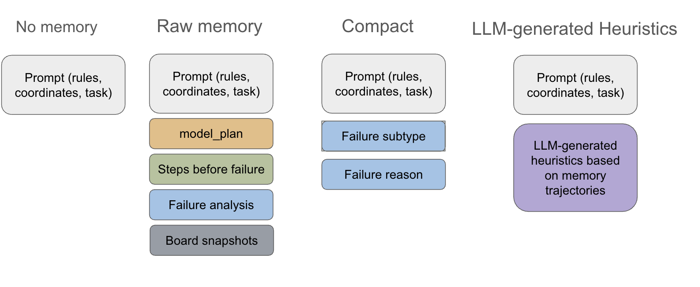

*Figure 1. Four planner conditions. All four share the same base prompt (rules, board, coordinates, planning checklist, memory block, JSON-only output contract). **Raw trajectory** adds rich failure context: the model plan, steps before the failed push, verifier analysis, and board snapshots. **Compact summary** keeps only structured failure fields (subtype, verifier reason). **Reflection heuristic** stores LLM-distilled rules from the failure—useful when trajectories exceed the token budget or for cross-level transfer (train-to-eval).*

### Technical crux

The hard part was not “call an LLM API” but **harness engineering**:

- Build a **deterministic executor** that expands each push into walking moves and rejects illegal geometry.
- **Diagnose failures** locally (unreachable standing cell, blocked destination, deadlock, truncated plan).
- **Compress failures into token-budgeted memory** without leaking full solution spoilers.
- **Isolate memory effects** with matched models, caches, and stratified benchmarks.

Early runs showed ~48% of failures are **invalid plans** (local legality), not high-level strategy errors. That shifted the project toward verifier-grounded memory rather than generic planning tips.

---

## Approach

### What we started with

We built the Sokoban memory system from scratch in this repo: the environment, full-path LLM planner, local executor/verifier, v3 Boxoban benchmark suite, memory renderers, same-level retry pipeline, train-to-eval heuristic pipeline, and evaluation scripts.

### Four memory strategies

| Strategy | What is stored | Shown to planner on retry |
|----------|----------------|---------------------------|
| **No memory** | — | Empty-state message only |
| **Raw trajectory** | Compact failure evidence: boards, failed push, push log | Same-level raw evidence block |
| **Compact summary** | Failed push index, failure subtype, verifier reason | Verifier-summary block (~200 tokens) |
| **Reflection heuristic** | LLM-distilled rules from failures | Numbered heuristic strings (~300 tokens) |

**Same-level retry:** up to **K = 3** attempts per level; memory updates only after a failed attempt on *that* level.

**Train-to-eval:** failures on 24 train levels → global heuristic bank → same top-K rules on all 24 eval levels (no raw cross-level trajectories).

### System architecture

The planner LLM outputs one JSON push plan per attempt. A **local verifier** (not the LLM) parses each intent, checks standing-cell reachability with BFS, executes walking moves plus pushes, and records structured failure evidence. On retry, that evidence is rendered as raw trajectory memory, compact verifier summary, or—after a separate reflection LLM call—heuristic rules.

*Figure 2. Same-level memory retry pipeline. The model retries the same level with memory accumulated from previous failed attempts on that level.*

*Figure 3. Train-to-eval heuristic pipeline. Train failures are distilled into global heuristics and rendered on held-out eval levels.*

### Full-path planning loop

1. **Prompt** (`full_path_v2_1`): rules, board, coordinates, planning checklist, memory block, JSON-only output contract.
2. **LLM** returns a complete push plan (not single-step actions).
3. **Verifier** for each push: resolve box coordinate, compute required standing cell, BFS reachability, destination legality, execute, deadlock checks.
4. **Failure typing:** `invalid_plan`, `deadlock`, `plan_exhausted`, etc., with subtypes such as `unreachable_standing_cell`.
5. **Memory update** (retry conditions): append compressed episode; render memory for next attempt.

**Deadlock checks (local):** non-target corner, wall-segment trap, 2×2 freeze, two-box freeze.

### Level suite

Levels come from [Boxoban](https://github.com/google-deepmind/boxoban-levels). Within each source family (`medium`, `unfiltered`), candidates are sorted by a structural difficulty score and split into **open**, **middle**, and **constrained** thirds (4 levels each per split × family).

| Bucket | Avg. wall density | Avg. reachable ratio | Avg. initial legal pushes |
|--------|------------------:|---------------------:|--------------------------:|
| Open | 0.618 | 0.892 | 10.38 |
| Middle | 0.682 | 0.577 | 6.62 |
| Constrained | 0.690 | 0.063 | 1.25 |

---

## Evaluation & Results

### Experimental setup

| Parameter | Value |
|-----------|-------|
| Model | `gpt-5.2`, reasoning effort **low** |
| `max_output_tokens` | **16384** (8192 caused `empty_output` — reasoning consumed the budget) |
| Temperature | 0 |
| Eval split | 24 levels in `v3_boxoban_balanced.json` |
| Same-level attempts | **K = 3** |
| Baseline | Single-shot `no_memory` (also 33.3% on train) |
| Reproducibility | Per-condition LLM response cache namespaces |

**Baselines compared:** single-shot no memory; same-level compact, raw, heuristic retry; train-to-eval global heuristics (top-3 and all-16 variants).

**Why no raw memory in train-to-eval:** raw trajectories are **level-specific**; cross-level prompts may only use abstracted `global_allowed` heuristics (design choice to avoid leaking eval layouts).

We report **solve rate** (fraction of eval levels fully solved) and **average best goal completion** as a partial-progress indicator. For each level, we take the best moment in the trajectory—the maximum fraction of boxes on targets—and average that value across levels:

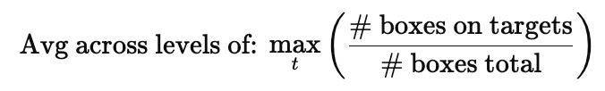

*Figure 4. Definition of average best goal completion: maximum boxes-on-targets fraction over the episode, averaged across levels.*

### Same-level retry results

**Solve rate @ K=3.** The figure below shows the fraction of eval levels solved within three attempts.

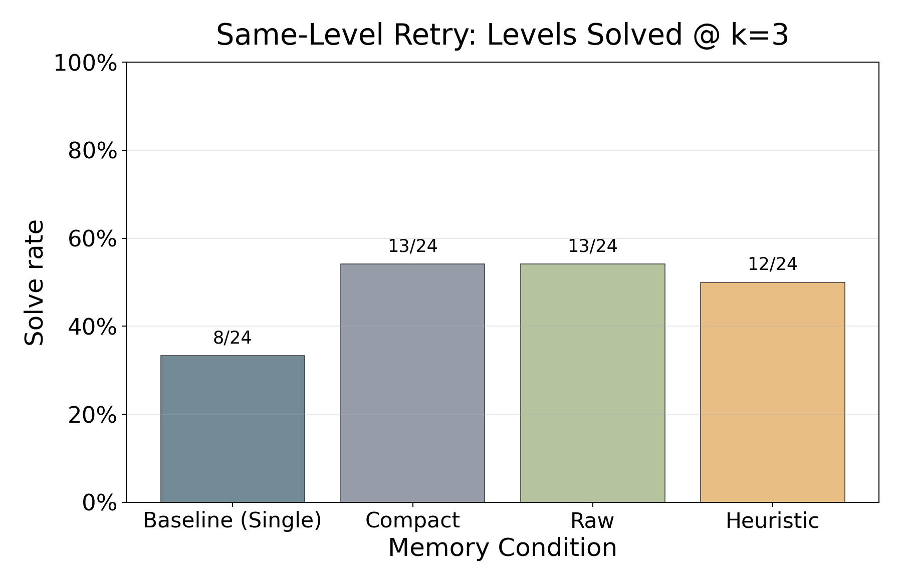

*Figure 5. **Solve rate @ K=3** on 24 eval levels. Compact summary and raw trajectory both reach **13/24 (54.2%)**, up from **8/24 (33.3%)** single-shot. Same-level heuristic reaches **12/24 (50.0%)**.*

**Average best goal completion @ K=3.**

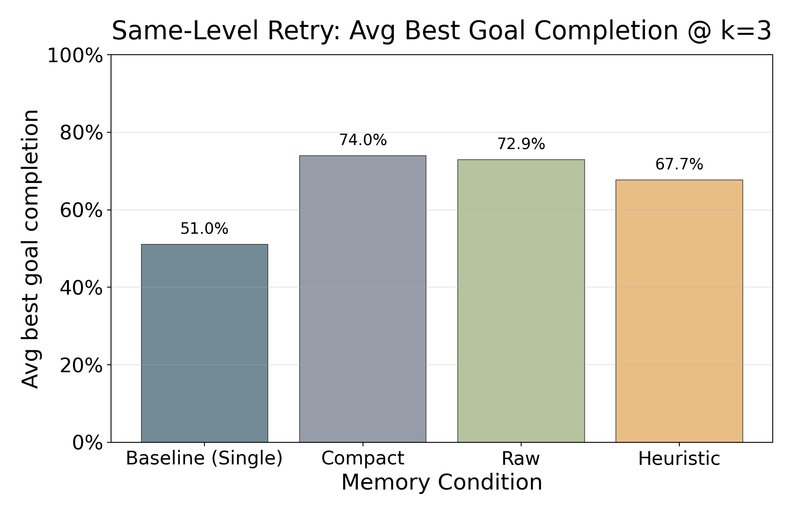

*Figure 6. **Average best goal completion @ K=3** by condition. Memory raises partial progress even when a level is not fully solved; compact and raw sit above heuristic.*

**Interpretation (same-level retry):**

- All three memory conditions beat the **33.3%** single-shot baseline—memory solve rate improves performance on the same puzzle under a fixed attempt budget.
- Compact summary and raw trajectory **tie at 54.2%** and both outperform same-level heuristic (**50.0%**)—instance-specific trajectory or verifier feedback helps more than distilled rules alone on held-out eval.

### Same-level retry: failure analysis

Failures remain common after memory; the question is whether the **mix** of failure types shifts in a useful way.

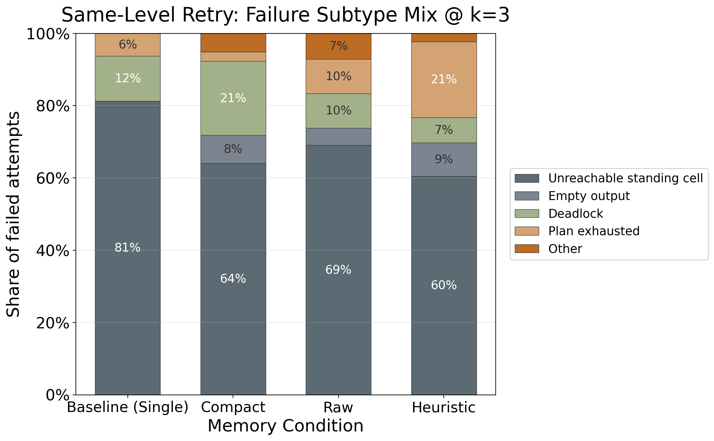

*Figure 7. **Failure subtype mix** (all K=3 attempts, by condition).*

**Interpretation:**

- **Unreachable standing cell** (the planned push is not legally reachable by the player) remains the largest bucket everywhere—local legality is still the bottleneck. Memory reduces this share relative to baseline but does not remove it.
- Compact summary shows a higher **deadlock** share than raw trajectory—compressed feedback drops spatial context that raw memory preserves, so the model can execute farther before trapping.
- Same-level heuristic lowers unreachable-standing-cell share the most (~60% vs. ~81% of failed attempts on baseline) but increases **plan_exhausted** (legal but incomplete plans)—rules improve legality without always extending the plan enough to finish.

Example distilled rules aligned with these shifts:

**Standing-cell reachability:** *“Before emitting a push intent, verify the required standing cell (one step opposite the push direction) is reachable from the player’s current region given the current box layout.”*

**Corridor / chokepoint avoidance:** *“Do not push a box into a 1-tile-wide corridor if that corridor is needed as a transit route to reach other pushes.”*

**Takeaway:** memory format changes which failure mode dominates—compact gives the strongest verifier signal, raw preserves spatial context, and heuristics trade deadlock risk for better reachability checks.

### Train-to-eval heuristic generalization

Cross-level memory pools train failures into **global heuristics** rendered on every eval level. Raw trajectories are excluded cross-level by design.

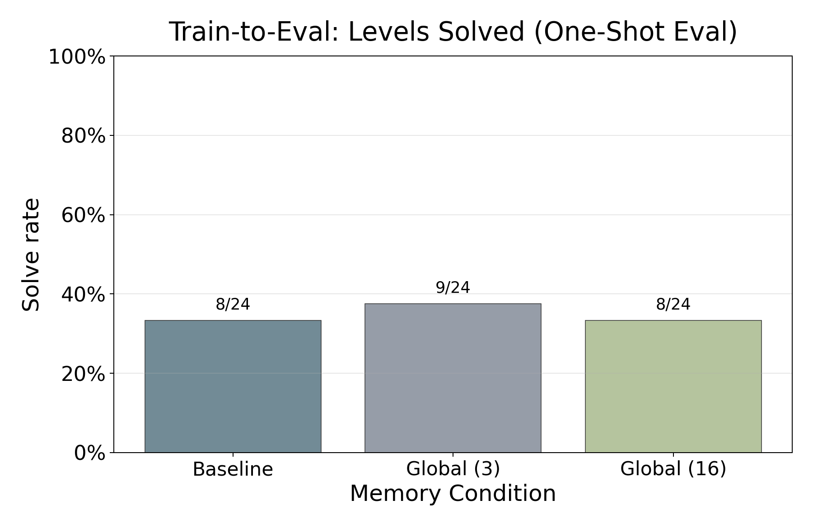

*Figure 8. **Train-to-eval solve rate.** Top-3 global heuristics improve from **8/24 to 9/24 (37.5%)**—only one extra level versus no-memory eval. Rendering **all 16** train-derived rules does not help (back to 33.3%): more heuristics ≠ better performance.*

| Condition | Eval solve rate | Levels solved |
|-----------|----------------:|--------------:|
| No-memory eval baseline | 33.3% | 8/24 |
| Train → eval (top 3 heuristics) | **37.5%** | 9/24 |
| Train → eval (all 16 heuristics) | 33.3% | 8/24 |

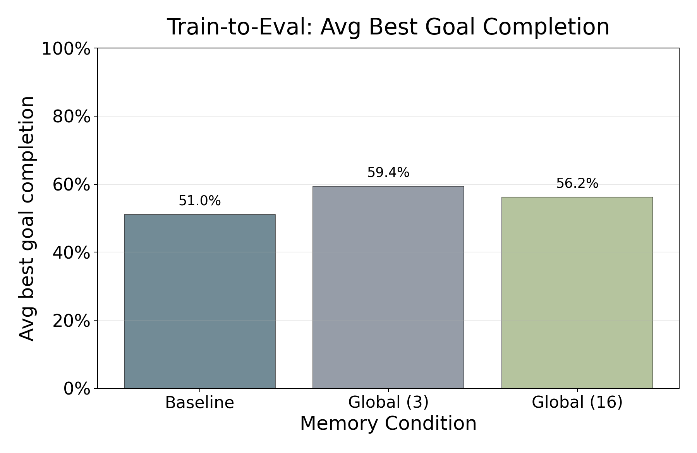

*Figure 9. **Best goal completion (train-to-eval).** Global heuristics raise average partial progress (~51% → ~59% with top-3 rules) even when full solve rate barely moves—memory avoids early catastrophes without guaranteeing full solves.*

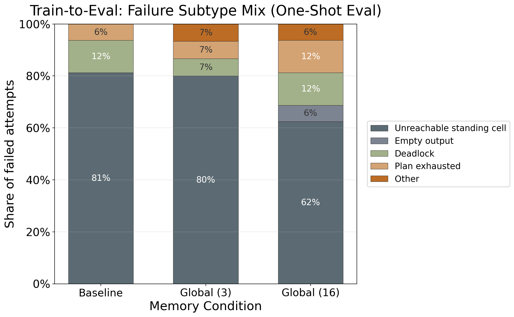

*Figure 10. **Train-to-eval failure mix.** Unreachable standing cells still dominate; adding more heuristic text does not change the fundamental error mode. Cross-level abstraction lacks the coordinate-specific signal that same-level compact and raw provide.*

**Why transfer is limited (interpretation; partly speculative):**

- **Domain shift** between train and eval layouts within the same bucket.
- **Abstraction gap** — rules like “check reachability” still require expensive per-puzzle re-reasoning.
- **Prompt bloat** — 16 heuristics consume context without puzzle-specific coordinates.

### Synthesis: does memory help?

| Claim | Evidence |
|-------|----------|
| Memory helps on **same-level retry** | Figures 5–6: solve rate **33.3% → 50–54%** at K=3 |
| **Instance-specific** beats **global** rules | Figure 5-6: both Compact and Raw beat Heuristics |
| **Format matters** | Figure 7: compact, raw, and heuristic shift failure subtypes differently |
| **More heuristics aren't better** | Figure 8-9: Using top-16 heuristics performns worse in train-to-eval than top 3 |
| Bottleneck remains **local validity** | Figures 7 and 10: unreachable standing cell still dominates |

---

## Team Responsibilities

**Aditri Patil:** Problem framing and refining system architecture. Built full-path planner, legal-push scaffolding, push guardrails, and verifier implementation. Failure-analysis and documentation; same-level reflection–heuristic pipeline, evaluation figure scripts, results visualizations (GIF and traces); V3 evaluation analysis; figures and final report.

**Kerui Lu:** Designed and built the system architecture, evaluation framework, the memory construction and usage formats and stratified Boxoban suite; drove version iteration from baseline to the final setup; collected experiment results; wrote the final report.

---

## References

1. Zhang, C., et al. (2024). *LMGame Bench: How Good are LLMs at Playing Games?*
2. Google DeepMind. *Boxoban Levels.* https://github.com/google-deepmind/boxoban-levels
3. Shinn, N., et al. (2023). *Reflexion: Language Agents with Verbal Reinforcement Learning.*
4. Liang, P., et al. (2024). *Synapse: Trajectory-as-Exemplar Prompting for Robustness.*
