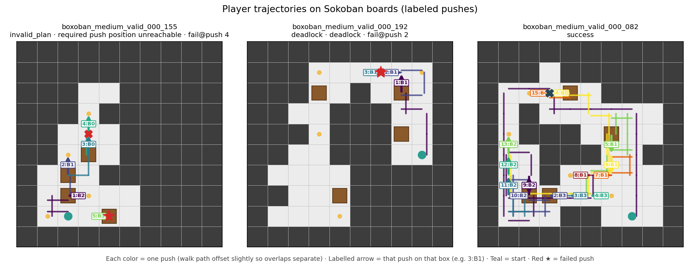
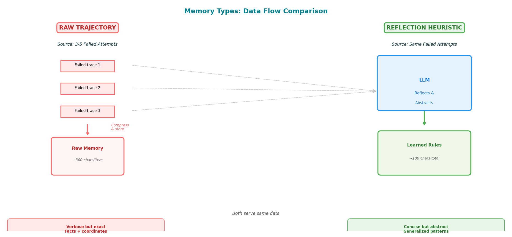
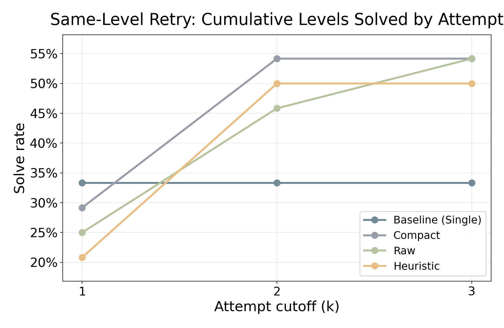
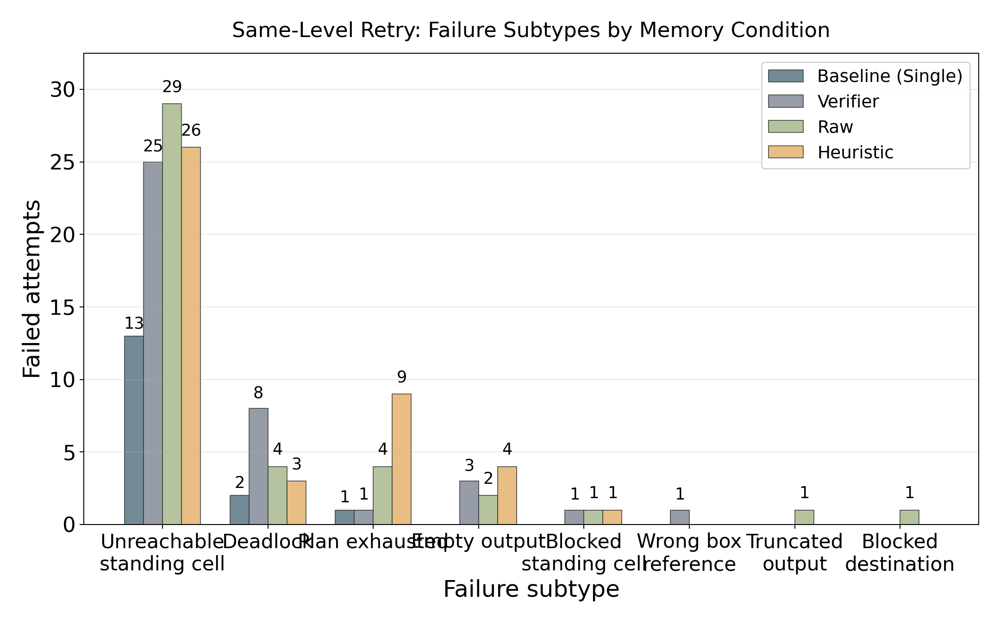
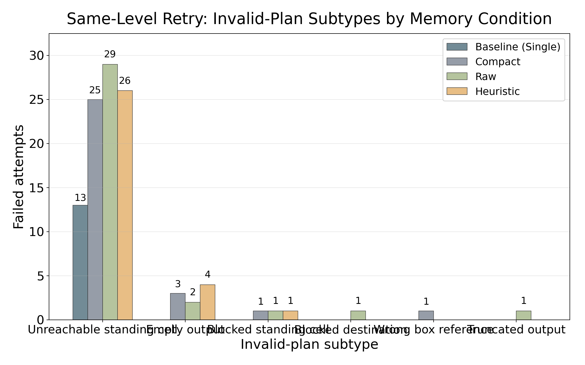
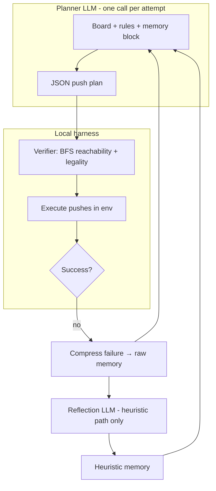

# The Impact of Memory Strategies on LLM-Based Sokoban Gameplay

**Aditri Patil** — apatil26@stanford.edu  
**Kerui Lu** — keruilu@stanford.edu

CS348K (Practical Large Language Models) · June 2026

---

## Main Takeaways

1. **GPT-5.2 single-shot solve rate is 33.3%** (8/24 eval levels) on our stratified Boxoban benchmark; failures are mostly **invalid plans** (~48%), especially **unreachable standing cells**—local legality errors, not abstract strategy mistakes.

2. **Same-level memory retry works.** With **K = 3** attempts, compact summary and raw trajectory both reach **54.2%** solve rate (+5 levels); same-level heuristics reach **50.0%** (+4 levels). Most gains appear by **attempt 2**.

3. **Instance-specific feedback beats global rules.** Same-level retry at 54.2% vs. train-to-eval global heuristics at **37.5%** (top-3 rules). Abstract heuristics help **partial progress** (best goal completion ~51% → ~59%) more than full solves.

4. **Memory format matters for *how* the model fails.** Compact summary best reduces unreachable pushes; raw trajectory rescues a **different** level subset at the same solve rate; heuristics improve legality language but add **plan_exhausted** and an extra LLM call.

5. **Harness quality was the technical crux**—full-path JSON planning, local verifier (BFS + deadlock checks), token-budgeted memory renderers, and stratified levels—not raw API usage.

6. **Next bottleneck:** expose **enumerated legal pushes** from the verifier; refine same-level reflection prompts (`v1_specific` / `v3_hybrid_verifier`) beyond generic `reflection_v2`.

---

## Figures

All plots are generated from raw episode JSONs under `results/` (see Appendix). Click paths in the repo browser to view full resolution.

| Fig. | File | What it shows |
|------|------|----------------|
| 1 | [trajectory_examples_labeled.png](figures/trajectory_examples_labeled.png) | Example invalid-plan vs. deadlock trajectories |
| 2 | [memory_dataflow.png](figures/memory_dataflow.png) | Planner → verifier → memory pipeline |
| 3 | [same_level_retry_condition_solve_rate_k3.png](figures/same_level_retry_condition_solve_rate_k3.png) | Eval solve rate @ K=3 by condition |
| 4 | [same_level_retry_cumulative_solved_by_attempt.png](figures/same_level_retry_cumulative_solved_by_attempt.png) | Cumulative levels solved across attempts |
| 5 | [same_level_retry_condition_avg_best_goal_completion_k3.png](figures/same_level_retry_condition_avg_best_goal_completion_k3.png) | Avg. best goal completion @ K=3 |
| 6 | [same_level_retry_failure_subtype_mix_k3.png](figures/same_level_retry_failure_subtype_mix_k3.png) | Failure subtype mix (same-level, all attempts) |
| 7 | [same_level_retry_failure_subtypes_by_condition.png](figures/same_level_retry_failure_subtypes_by_condition.png) | Failure subtypes stacked by condition |
| 8 | [same_level_retry_invalid_plan_subtypes_by_condition.png](figures/same_level_retry_invalid_plan_subtypes_by_condition.png) | Invalid-plan subtypes by condition |
| 9 | [train_to_eval_condition_solve_rate.png](figures/train_to_eval_condition_solve_rate.png) | Train-to-eval solve rate |
| 10 | [train_to_eval_avg_best_goal_completion.png](figures/train_to_eval_avg_best_goal_completion.png) | Train-to-eval best goal completion |
| 11 | [train_to_eval_failure_subtype_mix.png](figures/train_to_eval_failure_subtype_mix.png) | Train-to-eval failure mix |

### Figure gallery (embedded)

**Figure 1 — Failure trajectory examples**



**Figure 2 — System data flow**



**Figure 3 — Same-level solve rate @ K=3**


**Figure 4 — Cumulative solved by attempt**



**Figure 5 — Best goal completion @ K=3**


**Figure 6 — Failure subtype mix (same-level)**


**Figure 7 — Failure subtypes by condition**



**Figure 8 — Invalid-plan subtypes by condition**



**Figure 9 — Train-to-eval solve rate**


**Figure 10 — Train-to-eval best goal completion**


**Figure 11 — Train-to-eval failure mix**


---

## Background and Setup

### What is Sokoban?

Sokoban is a grid puzzle: push every box onto a target square. The player moves one cell at a time and can only push boxes (never pull). A single bad push can create an irreversible deadlock, so mistakes compound over a long horizon.

### Why is Sokoban hard for LLMs?

Our presentation frames three core challenges:

1. **Irreversible moves → deadlocks** — one corner push can make the level unsolvable.
2. **Coordinate tracking of multiple boxes** — each push updates box coordinates; one wrong `[row, col]` invalidates the rest of the plan.
3. **Long-horizon planning** — solutions require many dependent pushes; early errors prune valid futures.

### Problem definition

| Aspect | Specification |
|--------|----------------|
| **Inputs** | ASCII board (walls, boxes, targets, player) plus game rules |
| **Outputs** | JSON array of semantic push intents: `{"box": [r, c], "push": "Up/Down/Left/Right"}` per step |
| **Goals** | All boxes on targets with **no invalid steps** during execution |
| **Constraints** | Fixed attempt budget, token budget, deterministic temperature-0 runs |
| **Primary metric** | **Solve rate** — fraction of levels fully solved |
| **Dataset** | `levels/v3_boxoban_balanced.json`: 24 train + 24 eval Boxoban levels (10×10, 4 boxes), stratified by source family and difficulty bucket |

### Research questions

1. How well does an LLM solve Sokoban **without** memory?
2. What **failure types** dominate?
3. Can **memory of prior failures** improve performance?
4. Which memory format helps most: **raw trajectory**, **compact verifier summary**, or **reflection heuristics**?
5. Can memory **generalize** from train failures to held-out eval levels?

**Central hypothesis (falsifiable):** *Instance-specific feedback on the current puzzle* (same-level retry) will outperform *abstract rules* distilled from other puzzles (train-to-eval heuristics).

### Technical crux

The hard part was not “call an LLM API” but **harness engineering**:

- Build a **deterministic executor** that expands each push into walking moves and rejects illegal geometry.
- **Diagnose failures** locally (unreachable standing cell, blocked destination, deadlock, truncated plan).
- **Compress failures into token-budgeted memory** without leaking full solution spoilers.
- **Isolate memory effects** with matched models, caches, and stratified benchmarks.

Early runs showed ~48% of failures are **invalid plans** (local legality), not high-level strategy errors. That shifted the project toward verifier-grounded memory rather than generic planning tips.

### Prior benchmarks

LMGame Bench (Zhang et al.) reports weak LLM Sokoban performance with visual + memory modules but does not compare memory *formats*. We use Boxoban levels and our own verifier-centric memory ablations.

---

## Approach

### Research motivation

Prior work motivates three memory families:

- **LMGame** — memory module for Sokoban without comparing representations.
- **Reflexion** — linguistic feedback after failure (coding agents).
- **Synapse** — retrieved trajectories as in-context examples for control tasks.

We ask: *which representation* helps Sokoban full-path planning under a fixed verifier?

### Four memory strategies

| Strategy | What is stored | Shown to planner on retry |
|----------|----------------|---------------------------|
| **No memory** | — | Empty-state message only |
| **Raw trajectory** | Compact failure evidence: boards, failed push, push log | Same-level raw evidence block |
| **Compact summary** | Failed push index, failure subtype, verifier reason | Verifier-summary block (~200 tokens) |
| **Reflection heuristic** | LLM-distilled rules from failures | Numbered heuristic strings (~300 tokens) |

**Same-level retry:** up to **K = 3** attempts per level; memory updates only after a failed attempt on *that* level.

**Train-to-eval:** failures on 24 train levels → global heuristic bank → same top-K rules on all 24 eval levels (no raw cross-level trajectories).

*See Figure 1 in the gallery above.*

### System architecture



*See Figure 2 in the gallery above.*

### Full-path planning loop

1. **Prompt** (`full_path_v2_1`): rules, board, coordinates, planning checklist, memory block, JSON-only output contract.
2. **LLM** returns a complete push plan (not single-step actions).
3. **Verifier** for each push: resolve box coordinate, compute required standing cell, BFS reachability, destination legality, execute, deadlock checks.
4. **Failure typing:** `invalid_plan`, `deadlock`, `plan_exhausted`, etc., with subtypes such as `unreachable_standing_cell`.
5. **Memory update** (retry conditions): append compressed episode; render memory for next attempt.

**Deadlock checks (local):** non-target corner, wall-segment trap, 2×2 freeze, two-box freeze.

### Level suite

Levels come from [Boxoban](https://github.com/google-deepmind/boxoban-levels). Within each source family (`medium`, `unfiltered`), candidates are sorted by a structural difficulty score and split into **open**, **middle**, and **constrained** thirds (4 levels each per split × family).

| Bucket | Avg. wall density | Avg. reachable ratio | Avg. initial legal pushes |
|--------|------------------:|---------------------:|--------------------------:|
| Open | 0.618 | 0.892 | 10.38 |
| Middle | 0.682 | 0.577 | 6.62 |
| Constrained | 0.690 | 0.063 | 1.25 |

### Hypotheses tested

| ID | Hypothesis | Outcome |
|----|------------|---------|
| **H1** | With verifier feedback, memory improves action quality vs. drowning in legality noise | **Supported** — same-level retry raises solve@3 from 33% → 50–54% (Figures 3–4) |
| **H2** | Reflection heuristics outperform raw memory on **deadlock avoidance** | **Not supported** — compact summary shows *more* deadlock than raw (Figure 6–7) |
| **H3** | Fair memory comparison requires a working harness | **Supported** — prompt/token ablations preceded memory experiments |

### What we started with

We began from the course Sokoban scaffold (grid env, baseline agents) and the Week 6 one-step LLM policy. **Our work:** full-path JSON planning, V3 verifier executor, four memory conditions, stratified Boxoban benchmark, evaluation/plotting scripts, and reflection pipeline (`sokoban_memory/`).

---

## Evaluation and Results

### Definition of success

**Primary success:** Higher **solve rate** on held-out eval levels when memory is enabled under a fixed attempt budget.

**Secondary evidence:**

- Lower **invalid-plan** and **unreachable_standing_cell** rates
- Higher **best goal completion** (max boxes on targets before failure, averaged over levels)
- Interpretable **failure-subtype shifts** under each memory format

**Operational solved:** all boxes on targets, zero invalid executed steps (verifier-enforced).

### Experimental setup

| Parameter | Value |
|-----------|-------|
| Model | `gpt-5.2`, reasoning effort **low** |
| `max_output_tokens` | **16384** (8192 caused `empty_output` — reasoning consumed the budget) |
| Temperature | 0 |
| Eval split | 24 levels in `v3_boxoban_balanced.json` |
| Same-level attempts | **K = 3** |
| Baseline | Single-shot `no_memory` (also 33.3% on train) |
| Reproducibility | Per-condition LLM response cache namespaces |

**Baselines compared:** single-shot no memory; same-level compact, raw, heuristic retry; train-to-eval global heuristics (top-3 and all-16 variants).

**Why no raw memory in train-to-eval:** raw trajectories are **level-specific**; cross-level prompts may only use abstracted `global_allowed` heuristics (design choice to avoid leaking eval layouts).

### How good are LLMs at Sokoban initially?

**Single-shot solve rate: 33.3%** (8/24) on both train and eval.

| Failure category | Eval count (of 24) |
|------------------|-------------------:|
| Invalid plan | 13 |
| Success | 8 |
| Deadlock | 2 |
| Plan exhausted | 1 |

**Dominant subtype:** `unreachable_standing_cell` — the model names a push whose required standing cell is not reachable given current walls/boxes. This is a **local legality** error, not necessarily wrong high-level strategy.

### Same-level retry results

All three memory conditions beat the single-shot baseline at **K = 3** (Figure 3).

| Condition | Solve @ 1 | Solve @ 3 | Levels gained vs. baseline |
|-----------|----------:|----------:|---------------------------:|
| Single-shot (no memory) | 33.3% | 33.3% | — |
| Compact summary | 29.2% | **54.2%** | +5 |
| Raw trajectory | 25.0% | **54.2%** | +5 |
| Heuristic (same-level) | 20.8% | **50.0%** | +4 |

**Interpretation — solve @ 1:** First-attempt rates differ across conditions even when memory is empty, because the **prompt header** (`Condition: …`) and empty-state wording differ, and retry attempt-0 uses a **different seed schedule** than the single-shot baseline. We treat **solve @ 3** as the fair memory comparison; solve @ 1 is at best a “primed single-shot” diagnostic, not a memory effect.

**Interpretation — solve @ 3:** Compact and raw tie at 54.2% but rescue **different** levels; heuristic reaches 50% with an extra reflection LLM call. Cumulative curves (Figure 4) show most improvement by attempt 2.

### Partial progress improves even when solve rate lags

**Best goal completion** = (maximum boxes on targets before failure) / (total boxes), averaged over levels (Figure 5). Memory increases partial progress even on levels that never fully solve.

### Failure analysis: what memory changes

Figures 6–8 summarize how failure types shift under each memory format.

**Unreachable standing cell (invalid plans):**

| Condition | Share of failed attempts (approx.) |
|-----------|-----------------------------------:|
| Baseline | ~81% |
| Compact summary | ~60% |
| Raw trajectory | ~69% |
| Heuristic | ~60% |

**Trade-offs:**

- **Heuristics** — better legality language; more **`plan_exhausted`** under generic `reflection_v2`.
- **Compact summary** — fewer unreachable pushes; can increase **deadlock** vs. raw.
- **Raw trajectory** — complementary level rescues at the same aggregate solve rate.

Example compact memory shown to the planner on retry:

```
Verifier summary from the previous same-level attempt:
level_id: boxoban_medium_valid_000_092
failed_push_index: 5
failure_subtype: blocked_standing_cell
verifier_reason: required_push_position_blocked_by_box
```

### Representative distilled heuristics

1. **Standing-cell reachability** — verify the standing cell is reachable in the *current* layout before emitting a push.
2. **Corridor fragility** — do not park a box in a 1-wide corridor needed for later access.
3. **Self-blocking** — avoid pushes that wall off the only future approach square.

### Train-to-eval heuristic generalization

| Condition | Eval solve rate | Levels solved |
|-----------|----------------:|--------------:|
| No-memory eval baseline | 33.3% | 8/24 |
| Train → eval (top 3 heuristics) | **37.5%** | 9/24 |
| Train → eval (all 16 heuristics) | 33.3% | 8/24 |

Figures 9–11: solve rate gains are small, but **best goal completion** rises (~51% → ~59%) with top-3 global rules—partial progress without full solves.

**Why transfer is limited (interpretation + speculation):**

- **Domain shift** between train and eval layouts within the same bucket.
- **Abstraction gap** — rules still require expensive per-puzzle re-reasoning.
- **Prompt bloat** — 16 heuristics consume context without puzzle-specific coordinates.

### Synthesis: does memory help?

| Claim | Evidence |
|-------|----------|
| Memory helps on **same puzzle** | +5–6 levels at K=3 vs. baseline (Figures 3–4) |
| **Instance-specific** beats **global** rules | 54.2% same-level vs. 37.5% train-to-eval |
| **Format matters** | Figures 6–8; compact on legality, raw on complementary rescues |
| Bottleneck remains **local validity** | Unreachable standing cell still #1 after memory |

### Limitations and open questions

1. **Invalid-plan ceiling** — enumerate legal pushes from the verifier for the planner.
2. **k=1 confound** — not used to rank memory modes.
3. **Medium-stratum weakness** — medium-middle eval levels often stay at 0% solve.
4. **Heuristic generator** — try `v1_specific` / `v3_hybrid_verifier` reflection prompts.

---

## Team Responsibilities

**Aditri Patil:** Problem framing and hypotheses; full-path planner + verifier implementation; memory renderers (raw, compact, heuristic); prompt iteration (`full_path_v2_1`); V3 evaluation runs and analysis; figures and final report.

**Kerui Lu:** Architecture and level-suite design; stratified Boxoban selection; evaluation coordination; failure-mode debugging; memory-format design feedback.

---

## References

1. Zhang, C., et al. (2024). *LMGame Bench: How Good are LLMs at Playing Games?*
2. Google DeepMind. *Boxoban Levels.* https://github.com/google-deepmind/boxoban-levels
3. Shinn, N., et al. (2023). *Reflexion: Language Agents with Verbal Reinforcement Learning.*
4. Liang, P., et al. (2024). *Synapse: Trajectory-as-Exemplar Prompting for Robustness.*
5. CS348K-Project repository: `sokoban_memory/`, `levels/v3_boxoban_balanced.json`, `docs/v3_memory_evaluation_report.md`.

---

## Appendix (experimental details)

**Token ablation:** At 8192 max output tokens, `gpt-5.2` often returned no parseable plan (`empty_output`); 16384 was required for visible JSON.

**Full-path vs. one-step:** One-step policies lost long-horizon structure; full-path matches how humans plan Sokoban (sequence of pushes).

**K = 3:** Attempt 2 captures most gains; K=5+ risks context bloat from accumulated memory.

**Figure regeneration:**

```bash
.venv/bin/python scripts/plot_same_level_k3_condition_comparison.py
.venv/bin/python scripts/plot_failure_subtypes_condition_comparison.py
.venv/bin/python scripts/plot_train_to_eval_condition_comparison.py
```

Outputs are written to `docs/figures/`.
